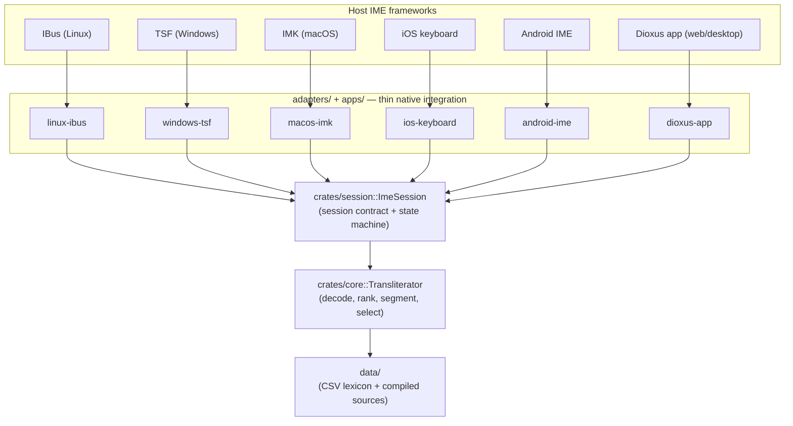
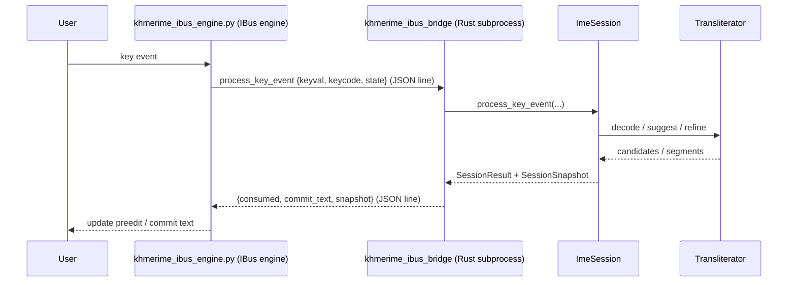

# KhmerIME

Type `nhomtovsalarien` and get `ខ្ញុំទៅសាលារៀន`.

<!-- TODO: demo GIF here -->

KhmerIME is a cross-platform Khmer input method engine built around a shared Rust
core. It provides consistent transliteration behavior across platforms while
keeping native integrations thin and platform-specific.

## Why KhmerIME

KhmerIME is designed as one input engine with multiple platform adapters. The
core transliteration behavior — decoding, ranking, segmentation, and candidate
selection — lives in:

- [crates/core/](crates/core) — the transliteration engine
- [crates/session/](crates/session) — the platform-neutral session contract

Platform integrations such as IBus, Windows TSF, macOS IMK, iOS keyboard, Android
IME, and the desktop/mobile scaffolds are intentionally thin. Their responsibility
is to translate native key events, lifecycle events, and platform behavior into
the shared session contract.

This architecture keeps the typing experience consistent across platforms while
allowing platform-specific development to move independently.



In short:

- One shared engine.
- Thin native adapters.
- Consistent behavior everywhere.
- Locked regression surface.

## Getting Started

```bash
make help
```

`make help` lists the available developer commands, including commands for running
apps, querying the engine, building data, and working with platform adapters.

For full build, run, and verification instructions, see
**[docs/development.md](docs/development.md)**.

## Project Layout

```text
crates/core/       Transliteration engine: lexicon, decoder, ranking
crates/session/    Platform-neutral session contract and state machine
adapters/          Native integrations for Linux, Windows, macOS, iOS, and Android
apps/              Dioxus app and lookup CLI
data/              CSV lexicon and compiled data sources
docs/              Development, architecture, platform, and design documentation
```

## Design Principles

- Keep transliteration behavior in one shared engine.
- Keep platform adapters thin and predictable.
- Avoid platform-specific logic drift.
- Preserve a stable regression surface for decoding and ranking.
- Prioritize low-latency typing behavior.
- Make platform development possible without changing the core typing experience.

## How a keystroke flows (Linux IBus)

The Linux path runs the engine as a Rust subprocess. The Python IBus engine owns
the desktop integration and talks to the `khmerime_ibus_bridge` binary over a JSON
line protocol; the bridge drives the shared session and returns a snapshot.



## Docs

- [docs/development.md](docs/development.md) — how to run and verify the project
- [CONTRIBUTING.md](CONTRIBUTING.md) — contribution rules and required checks
- [CONTEXT.md](CONTEXT.md) — domain vocabulary and how the pieces relate
- [docs/platforms/](docs/platforms/) — per-platform native packaging and install
- [docs/architecture/](docs/architecture/) — cross-platform performance patterns and subsystem design
- [docs/adr/](docs/adr/) — architecture decision records

## Data Credits

KhmerIME uses data and references from the following open-source projects:

- khPOS: https://github.com/ye-kyaw-thu/khPOS/tree/master
- Khmerlang Keyboard: https://github.com/khmerlang/Khmerlang-Keyboard
